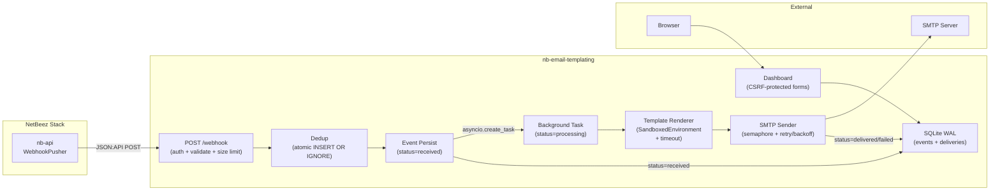

# Email Templating Service (DEV-2105)

## Architecture

A standalone Python/FastAPI service deployed as a Docker container. It receives outbound webhook POSTs from the existing nb-api `WebhookPusher`, renders Jinja2 email templates per event type, and delivers via SMTP. An embedded SQLite database tracks delivery history and deduplication. A built-in web dashboard provides visibility.




## Location and deployment model

- **Primary**: standalone repository (separate from nb-beezkeeper)
- **Standalone compose**: self-contained `docker-compose.yml` for independent deployment
- **Monorepo overlay**: optional `docker-compose.overlay.yml` fragment for integration into the nb-beezkeeper stack

## Webhook payload contract

The service will parse payloads matching the existing `Integrations::JsonApiAlertSerializer` and `Integrations::JsonApiIncidentSerializer` (`[json_api_alert_serializer.rb](app_data/docker/nb-api/app/serializers/integrations/json_api_alert_serializer.rb)`, `[json_api_incident_serializer.rb](app_data/docker/nb-api/app/serializers/integrations/json_api_incident_serializer.rb)`).

The `jsonapi-serializer` gem's `serializable_hash` (called in `[webhook_notification_pusher.rb](app_data/docker/nb-api/app/pushers/notification/webhook_notification_pusher.rb)`) produces these shapes:

### Single alert payload

```json
{
  "data": {
    "id": "12345",
    "type": "alert",
    "attributes": {
      "severity": 3,
      "severity_name": "warning",
      "alert_dedup_id": 12340,
      "event_type": "ALERT_OPEN",
      "agent": "Office-Agent-01",
      "agent_description": "Main office network agent",
      "target": "google.com",
      "wifi_profile": null,
      "destination": "8.8.8.8",
      "message": "Packet loss exceeded threshold (15%)",
      "test_type": "PingTest",
      "alert_ts": 1709712000000
    }
  }
}
```

### Aggregate alert payload (batch)

When multiple alerts fire simultaneously for the same entity, nb-api sends them as an array. Each element has the same shape as a single alert.

```json
{
  "data": [
    {
      "id": "12345",
      "type": "alert",
      "attributes": {
        "severity": 3,
        "severity_name": "warning",
        "alert_dedup_id": 12340,
        "event_type": "ALERT_OPEN",
        "agent": "Office-Agent-01",
        "destination": "8.8.8.8",
        "message": "Packet loss exceeded threshold",
        "test_type": "PingTest",
        "alert_ts": 1709712000000
      }
    },
    {
      "id": "12346",
      "type": "alert",
      "attributes": {
        "severity": 2,
        "severity_name": "critical",
        "alert_dedup_id": 12346,
        "event_type": "ALERT_OPEN",
        "agent": "Office-Agent-01",
        "destination": "1.1.1.1",
        "message": "DNS resolution failed",
        "test_type": "DnsTest",
        "alert_ts": 1709712001000
      }
    }
  ]
}
```

**Note on `test_counts`**: The serializer defines a `test_counts` attribute, but it is never included in webhook payloads. The worker does not pass the `entity` object to the pusher (see `push_aggregate_alert` in `webhook_notification_worker.rb` line 101), so the serializer's condition (`!options[:entity].blank?`) always fails. Templates should not rely on `test_counts`.

### Incident payload (INCIDENT_OPEN)

For INCIDENT_OPEN events, `event_ts` and `incident_ts` are both equal to the incident's `start_ts`.

```json
{
  "data": {
    "id": "789-1709712000000",
    "type": "incident",
    "attributes": {
      "incident_id": 789,
      "event": "INCIDENT_OPEN",
      "event_ts": 1709712000000,
      "agent": "Office-Agent-01",
      "agent_description": "Main office network agent",
      "agent_id": 42,
      "url": "https://netbeez.example.com/incidents/789",
      "message": "Multiple test failures detected on Office-Agent-01",
      "incident_ts": 1709712000000
    }
  }
}
```

### Incident payload (INCIDENT_CLEARED)

For INCIDENT_CLEARED events, `event_ts` is the incident's `end_ts` (when it was cleared), while `incident_ts` remains the original `start_ts`. The `data.id` uses `event_ts` as its timestamp component.

```json
{
  "data": {
    "id": "789-1709713500000",
    "type": "incident",
    "attributes": {
      "incident_id": 789,
      "event": "INCIDENT_CLEARED",
      "event_ts": 1709713500000,
      "agent": "Office-Agent-01",
      "agent_description": "Main office network agent",
      "agent_id": 42,
      "url": "https://netbeez.example.com/incidents/789",
      "message": "Incident Cleared",
      "incident_ts": 1709712000000
    }
  }
}
```

Key details for template authors:

- **Event type routing**: `attributes.event_type` for alerts, `attributes.event` for incidents
- **Conditional fields**: `agent`, `target`, `wifi_profile` are mutually exclusive on incidents (depends on `incident_reporting_entity_type`). On alerts, `agent` and `target` can both appear. `wifi_profile` only appears when the alert source is WiFi-related.
- **Timestamps**: All `*_ts` fields are **milliseconds since epoch** (divide by 1000 for seconds)
- **Incident timestamp semantics**: `event_ts` is `start_ts` for OPEN events, `end_ts` for CLEARED events. `incident_ts` is always `start_ts`. For INCIDENT_OPEN, `event_ts == incident_ts`. For INCIDENT_CLEARED, they differ.
- **INCIDENT_CLEARED message**: The `message` attribute for INCIDENT_CLEARED events is always the literal string `"Incident Cleared"`, not a dynamic message. Templates should account for this.
- **Incident URL**: The `url` attribute is an opaque link to the incident in the NetBeez dashboard, passed through from nb-api. The email service should not construct or modify this URL -- render it as-is in templates.
- `**test_counts`**: Defined in the serializer but never included in webhook payloads due to a missing `entity` pass-through in the worker. Templates should not rely on this field.

## Directory structure

```
nb-email-templating/          # standalone repository root
├── Dockerfile
├── docker-compose.yml              # Standalone deployment
├── docker-compose.overlay.yml      # Monorepo integration fragment
├── README.md                       # Install/run/config docs
├── pyproject.toml                  # Dependencies (FastAPI, Jinja2, aiosmtplib, SQLAlchemy, etc.)
├── config/
│   └── config.example.yaml         # Annotated example config
├── email_templates/                # Jinja2 email templates (mounted volume)
│   ├── _base.html.j2              # Shared layout
│   ├── alert_open.html.j2
│   ├── alert_cleared.html.j2
│   ├── incident_open.html.j2
│   ├── incident_cleared.html.j2
│   └── _fallback.html.j2          # Catch-all for unknown events
├── src/
│   └── nb_email_templating/
│       ├── __init__.py
│       ├── main.py                 # FastAPI app, lifespan, health, graceful shutdown
│       ├── config.py               # YAML config loader + env overrides + Pydantic validation
│       ├── database.py             # SQLAlchemy + SQLite models (events w/ status lifecycle, deliveries), WAL mode, indexes
│       ├── webhook.py              # POST /webhook endpoint (auth, size limit, malformed JSON handler)
│       ├── parser.py               # JSON:API payload normalizer (single, aggregate, incident)
│       ├── dedup.py                # Atomic INSERT OR IGNORE dedup; aggregate hash-based dedup; data retention cleanup
│       ├── renderer.py             # Jinja2 SandboxedEnvironment, FileSystemBytecodeCache, render timeout, fallback
│       ├── mailer.py               # Async SMTP with retry/backoff, error categorization, connection semaphore
│       ├── dashboard.py            # Dashboard routes + Jinja2 HTML views (CSRF-protected forms)
│       ├── template_editor.py      # Template CRUD API (path validation, atomic writes, syntax check)
│       ├── testing.py              # Test endpoints with rate limiting (SMTP test, payload render test)
│       ├── security.py             # CSRF middleware, token redaction, template name validation
│       └── logger.py               # Structured JSON logging with request_id tracing, rotation
├── dashboard_templates/            # Jinja2 templates for dashboard UI
│   ├── layout.html.j2
│   ├── index.html.j2              # Overview: templates, mappings, recent events
│   ├── events.html.j2             # Event history with delivery status
│   ├── config_view.html.j2        # Current config (redacted secrets)
│   ├── template_editor.html.j2    # In-browser template editor with live preview
│   └── test_tools.html.j2         # SMTP test + payload render test UI
├── static/                         # Dashboard CSS/JS
│   ├── style.css
│   └── editor.js                   # CodeMirror/textarea + live preview logic
└── tests/
    ├── conftest.py
    ├── test_webhook.py             # Auth, payload validation, size limits (header + streaming), malformed JSON, dedup integration
    ├── test_parser.py              # Single/aggregate/incident parsing, missing fields, unknown event types
    ├── test_dedup.py               # New event insert, duplicate rejection, aggregate hash dedup, data retention pruning
    ├── test_renderer.py            # Template selection, fallback chain, sandbox enforcement, render timeout, subject fallback
    ├── test_mailer.py              # SMTP success, temporary/permanent errors, retry exhaustion, semaphore, secret-safe logging
    ├── test_auth.py                # Token validation, session creation, CSRF validation, expired sessions, auth dependencies
    ├── test_template_editor.py     # Path traversal rejection, valid save, syntax validation, atomic writes, preview
    ├── test_admin.py               # Reload valid/invalid config, lock behavior, health check (DB + SMTP + log status)
    ├── test_config.py              # YAML loading, ${VAR} resolution, ${VAR:-default} syntax, missing env var error, Pydantic validation, invalid YAML
    ├── test_testing.py             # SMTP connectivity test, payload render test, send test email, rate limit enforcement
    ├── test_startup.py             # Startup recovery (re-queue received/stuck events), graceful shutdown (task tracking, timeout)
    ├── test_dashboard.py           # Dashboard GET routes render, secrets redacted in config view, pagination, retry button
    ├── test_retry.py               # Retry failed event, retry non-failed event (409), retry nonexistent event (404)
    └── test_integration.py         # Full pipeline: webhook receipt → parse → dedup → render → send → delivery record
```

## Key design decisions

### 1. Configuration (YAML + env overrides)

Single `config.yaml` with environment variable overrides for secrets. The config controls: SMTP settings, auth token, template-to-event mappings, recipient routing (to/cc/bcc per event type), dedup window, retry policy, and log settings.

**Environment variable resolution**: After loading the YAML file with PyYAML, the config loader walks the parsed dict and resolves `${VAR}` patterns in string values via `os.environ.get()`. Supports default values with `${VAR:-default}` syntax. Unresolved variables (no env var set, no default) raise a validation error at startup. This runs before Pydantic validation, so the Pydantic model sees fully-resolved values.

```yaml
server:
  host: 0.0.0.0
  port: 8025
  shutdown_timeout_seconds: 30       # graceful shutdown: max wait for in-flight tasks
  max_request_size: 1048576          # 1 MB max webhook payload size

auth:
  webhook_token: "${NB_EMAIL_WEBHOOK_TOKEN}"   # env override; passed as ?token= in URL

smtp:
  host: smtp.example.com
  port: 587
  starttls: true
  username: "${SMTP_USERNAME}"
  password: "${SMTP_PASSWORD}"
  from_address: "NetBeez Alerts <alerts@netbeez.local>"
  max_connections: 5                 # max concurrent SMTP connections (semaphore)

dedup:
  window_seconds: 3600

data_retention:
  days: 90                           # prune events/deliveries older than this
  cleanup_hour: 3                    # hour of day (0-23) to run daily cleanup

retry:
  max_attempts: 3
  backoff_base_seconds: 2
  backoff_max_seconds: 60
  recovery_timeout_seconds: 300      # events stuck in "processing" longer than this are re-queued on startup

rendering:
  template_render_timeout_seconds: 5 # max time for a single template render

test_tools:
  rate_limit_per_minute: 5           # max test emails per minute per session

templates:
  ALERT_OPEN:
    file: alert_open.html.j2
    active: true
    subject: "[NetBeez] Alert: {{ attributes.message }}"
    recipients:
      to: ["ops@example.com"]
      cc: []
      bcc: []
  ALERT_CLEARED:
    file: alert_cleared.html.j2
    active: true
    subject: "[NetBeez] Alert Cleared: {{ attributes.message }}"
    recipients:
      to: ["ops@example.com"]
      cc: []
      bcc: []
  INCIDENT_OPEN:
    file: incident_open.html.j2
    active: true
    subject: "[NetBeez] Incident: {{ attributes.message }}"
    recipients:
      to: ["ops@example.com"]
      cc: []
      bcc: []
  INCIDENT_CLEARED:
    file: incident_cleared.html.j2
    active: true
    subject: "[NetBeez] Incident Cleared: {{ attributes.message }}"
    recipients:
      to: ["ops@example.com"]
      cc: []
      bcc: []
  _fallback:
    file: _fallback.html.j2
    active: true
    subject: "[NetBeez] Event: {{ event_type }}"
    recipients:
      to: ["ops@example.com"]

logging:
  path: /var/log/nb-email-templating
  max_bytes: 10485760       # 10 MB
  backup_count: 5
  level: INFO
  format: json               # structured JSON log lines for grep/jq analysis
```

### 2. Authentication (URL query parameter token)

The nb-api `WebhookPusher` (`[webhook_pusher.rb](app_data/docker/nb-api/app/pushers/webhook_pusher.rb)` lines 33-39) only sends `Content-Type: application/json` -- it does **not** support custom headers or Bearer tokens. The `Webhook` model has no header/token fields either.

**Solution**: Token-in-URL authentication. The admin configures the webhook URL in nb-api to include the token as a query parameter:

```
http://nb-email-templating:8025/webhook?token=my-secret-token
```

The service validates `?token=` against `auth.webhook_token` in config. This requires zero changes to nb-api. The dashboard and admin endpoints use the same token, with two accepted authentication methods:

1. **Query parameter**: Pass `?token=<secret>` on any request (webhook, dashboard, or admin).
2. **Session cookie**: When a dashboard page is accessed with a valid `?token=` parameter, the server sets an `HttpOnly` session cookie (configurable expiry, default 24 hours). Subsequent dashboard requests use this cookie, so the token does not need to be repeated in every URL. The cookie should be marked `Secure` when the service is behind HTTPS.

The webhook endpoint (`POST /webhook`) always requires the `?token=` query parameter (it does not accept cookies, since nb-api sends the token in the URL). The `GET /health` endpoint requires no authentication.

**Auth dependency structure**: Authentication is implemented as three FastAPI `Depends()` functions in `security.py`, used declaratively by routes:

- `require_webhook_token` — validates `?token=` query parameter only. Used by `POST /webhook`.
- `require_auth` — validates `?token=` query parameter OR session cookie. Used by all dashboard `GET` routes.
- `require_auth_csrf` — validates `?token=` or session cookie, AND validates CSRF token on the request body/header. Used by all dashboard mutation routes (`POST`, `PUT`, `DELETE`).

Routes declare their auth requirement via `Depends()`:

```python
@router.post("/webhook", dependencies=[Depends(require_webhook_token)])
@router.get("/events", dependencies=[Depends(require_auth)])
@router.post("/events/{id}/retry", dependencies=[Depends(require_auth_csrf)])
```

**CSRF protection**: Dashboard mutation endpoints (POST, PUT, DELETE on template editor, test tools, admin reload) are protected by CSRF tokens. The server generates a per-session CSRF token when a session cookie is established, and embeds it as a hidden field in all dashboard forms. The server validates the CSRF token on every mutation request from the dashboard. The webhook endpoint (`POST /webhook`) is exempt from CSRF validation since it uses `?token=` query parameter authentication, not cookies.

### 3. Webhook processing model (asynchronous)

The webhook endpoint processes requests in two phases:

1. **Synchronous (in request)**: Validate auth token, enforce payload size limit (two-phase: fast-reject if `Content-Length` header exceeds `max_request_size`, then read body with a streaming byte limit to catch chunked/missing-header cases — returns 413 either way), parse and validate JSON:API payload, check dedup via atomic `INSERT OR IGNORE`, persist event with `status=received` to SQLite. Return 200 immediately.
2. **Asynchronous (background coroutine)**: Update event status to `processing`, resolve template, render email (with configurable timeout, default 5 seconds via `asyncio.wait_for`), send via SMTP with retry/backoff, record delivery result to SQLite, update event status to `delivered` or `failed`.

This is implemented via `asyncio.create_task()` spawned from the webhook handler after the event is persisted. The background task handles template rendering, SMTP delivery, and delivery logging. This ensures nb-api's webhook POST returns quickly even when SMTP delivery involves retries.

**Template rendering errors**: The background task wraps template rendering in try/except for `TemplateSyntaxError`, `UndefinedError`, and `asyncio.TimeoutError`. On error, the task first attempts to render the fallback template (`_fallback.html.j2`). If the fallback also fails, the event is marked `status=failed` with the error recorded in the delivery record. All rendering errors are logged with the event ID and template name.

**Subject line rendering errors**: Subject lines are also Jinja2 template strings. If a subject template fails to render, the renderer falls back to a static subject: `"[NetBeez] {event_type} Notification"` (using Python string formatting, not Jinja2). The error is logged but does not trigger body template fallback — the body renders independently. Only if both subject and body rendering fail entirely is the event marked `status=failed`.

**Malformed JSON handling**: FastAPI's default 422 response for JSON parse errors is replaced with a custom exception handler that returns a clean 400 response with a structured error message (no internal details leaked).

**Startup recovery**: On startup, the service queries for events in `received` status (background task never started) and events in `processing` status older than `retry.recovery_timeout_seconds` (configurable, default 300 seconds) that are assumed stuck. These events are re-enqueued for background delivery processing. Events already in `delivered` or `failed` status are not re-processed.

**Graceful shutdown**: On SIGTERM, the service tracks all active delivery tasks via a set. The shutdown handler awaits all in-flight tasks with a configurable timeout (`server.shutdown_timeout_seconds`, default 30 seconds) before exiting. Events that don't complete within the timeout remain in `processing` status and will be recovered on the next startup.

### 4. Deduplication

SQLite table `events` with a `UNIQUE` constraint on `event_id`. Deduplication uses an atomic `INSERT OR IGNORE` pattern -- if the insert affects zero rows, the event is a duplicate and is silently accepted (200, no email sent). This eliminates the TOCTOU race condition that would occur with a separate SELECT-then-INSERT approach.

**Event lifecycle**: The `events` table includes a `status` column tracking processing state:

```
received → processing → delivered
                      → failed → (manual retry) → received
```

- `received`: Event persisted, background delivery task not yet started
- `processing`: Background task is actively rendering/sending
- `delivered`: Email successfully sent, delivery record written
- `failed`: Permanent delivery failure (e.g., SMTP auth error, template error). Can be manually retried.

**Manual retry**: A `POST /events/{id}/retry` endpoint (auth + CSRF required) resets a `failed` event's status back to `received` and re-enqueues it for background delivery. This allows operators to recover from transient SMTP outages without re-triggering the webhook from nb-api. The dashboard event history includes a "Retry" button for failed events. The `deliveries` table retains the original failure record for audit. Only events in `failed` status can be retried; other statuses return 409 Conflict.

**Database configuration**:

- **WAL mode**: SQLite is configured with `PRAGMA journal_mode=WAL` on connection init for concurrent read/write access. This prevents readers from blocking writers during background delivery operations.
- **Indexes**: `events.event_id` (UNIQUE), `events.status`, `events.created_at`, `deliveries.event_id`, `deliveries.created_at`

**Aggregate alert dedup**: Aggregate alert payloads (`data` is an array) have no top-level `id`. The dedup key is computed as a SHA-256 hash of the sorted `data[*].id` values (e.g., `sha256("12345|12346")`). This is deterministic and handles reordering -- if nb-api retries the same batch, it produces the same key.

**Data retention**: A periodic cleanup task prunes events and deliveries older than `data_retention_days` (configurable, default 90 days). This prevents unbounded SQLite growth. The cleanup runs as an `asyncio` background task started in the FastAPI lifespan handler, executing once daily at a configurable hour (default: 03:00 local time). The first run is scheduled relative to the current time at startup. The actual deletion runs via `asyncio.to_thread()` to avoid blocking the event loop during large deletes — this keeps webhook processing and delivery tasks responsive while old data is being pruned.

**Why 200 and not 202**: nb-api's `WebhookPusher` only considers HTTP 200 as success for logging. Any other status code (including 202) causes nb-api to log "Webhook sent but received a non 200 code" on every delivery. Returning 200 avoids this noise.

### 5. Template rendering

Jinja2 templates in a mounted volume using `jinja2.SandboxedEnvironment` (see Security section). Each event type maps to a template file. Templates receive the full `attributes` dict plus metadata (`event_type`, `data_type`, `event_id`). A shared `_base.html.j2` provides consistent email layout. The email subject line is also a Jinja2 template string (defined in config). Template compilation is cached via `jinja2.FileSystemBytecodeCache` for faster rendering after first load.

Template rendering is wrapped in `asyncio.wait_for(timeout=template_render_timeout_seconds)` (configurable, default 5 seconds) to prevent runaway templates from blocking the event loop.

**Aggregate alert handling**: When the payload contains an array of alerts (`data` is a list), the service sends **one digest email per batch**, not one email per alert. The parser normalizes the payload into a list of alert objects. The template receives an `alerts` list (even for single alerts, which are wrapped in a one-element list). Templates iterate over `alerts` to render all alerts in a single email body. This matches the intent of nb-api batching related alerts together.

### 6. SMTP delivery

Async SMTP via `aiosmtplib` with exponential backoff retry. Delivery results (success/failure, attempts, error message) are stored in the SQLite `deliveries` table and surfaced on the dashboard.

**Error categorization**: SMTP errors are classified as temporary (retriable) or permanent (not retriable):


| Error type | Examples                                                        | Action                                              |
| ---------- | --------------------------------------------------------------- | --------------------------------------------------- |
| Temporary  | Connection refused, timeout, DNS failure, SMTP 4xx responses    | Retry with exponential backoff up to `max_attempts` |
| Permanent  | SMTP authentication failure, SMTP 5xx responses, TLS/SSL errors | Record failure immediately, do not retry            |


Only temporary errors trigger retries. Permanent errors are recorded in the delivery log with the specific error class and message, and the event is marked `status=failed`.

**Connection concurrency**: An `asyncio.Semaphore(smtp.max_connections)` (configurable, default 5) bounds the number of concurrent SMTP connections. Under burst load, background delivery tasks wait for an available semaphore slot before opening an SMTP connection. This prevents overwhelming the SMTP relay with many simultaneous connections.

### 7. Dashboard

Server-rendered HTML pages (Jinja2 + minimal CSS). Routes:

- `GET /` -- overview: template inventory, activation status, recent deliveries
- `GET /events` -- paginated event history with delivery status, filters, and retry buttons for failed events
- `POST /events/{id}/retry` -- retry a failed event (auth + CSRF required; 409 if not in `failed` status)
- `GET /config` -- current configuration (secrets redacted)
- `GET /health` -- JSON health check (SMTP reachable, DB writable, log writable, disk space on SQLite volume)
- `GET /templates` -- template editor (see below)
- `GET /test` -- test tools (see below)

### 8. Template editor (dashboard UI)

A web-based template editor accessible at `GET /templates` that lets administrators:

- **List** all installed email templates with their event type mappings and active/inactive status
- **View/edit** template source (Jinja2 HTML) in a code editor textarea (with syntax highlighting via CodeMirror CDN or similar lightweight editor)
- **Live preview** -- render the template with a sample payload and display the HTML result in an iframe side-by-side with the editor
- **Save** changes back to the template file on disk (writes to the mounted `email_templates/` volume). Saves use **atomic file writes** (write to a temp file in the same directory, then `os.replace()` to rename) so that background rendering tasks never read a partially-written template. Before saving, the server validates the template has valid Jinja2 syntax; saves with syntax errors are rejected with an error message.
- **Activate/deactivate** templates per event type

**Template name validation**: All template `{name}` parameters are validated against the regex `^[a-zA-Z0-9_.-]+\.html\.j2$`. Names containing `/`, `\`, `..`, or any characters outside the allowlist are rejected with 400. The server also resolves the final file path and verifies it is within the `email_templates/` directory as a defense-in-depth measure against path traversal.

API endpoints backing the editor:

- `GET /api/templates` -- list all templates with metadata
- `GET /api/templates/{name}` -- get template source
- `PUT /api/templates/{name}` -- save template source (validates Jinja2 syntax before writing; CSRF token required)
- `POST /api/templates/{name}/preview` -- render template with provided or sample payload, return HTML (CSRF token required)

### 9. Built-in test tools (dashboard UI)

Accessible at `GET /test` in the dashboard. Two test functions:

**SMTP connectivity test** (`POST /test/smtp`):

- Sends a simple test email to a user-specified address using the current SMTP configuration
- Reports success/failure with detailed error message
- Validates SMTP is reachable before real events arrive

**Payload render + send test** (`POST /test/render`):

- User selects an event type from a dropdown (ALERT_OPEN, ALERT_CLEARED, INCIDENT_OPEN, INCIDENT_CLEARED)
- Service provides a pre-filled sample JSON payload matching the real format (editable in a textarea)
- "Preview" button renders the template and shows the HTML result
- "Send test email" button renders AND sends to a user-specified address
- This lets admins verify templates look correct before going live

Both tools are available from the dashboard UI with simple forms -- no curl/API knowledge required.

### 10. Admin endpoints

- `POST /admin/reload` -- hot-reload config and templates (auth + CSRF required). The reload process **validates the new config fully** (YAML parse, Pydantic schema validation, template directory exists) before applying. If validation fails, the reload is rejected with an error message and the existing config remains active. An `**asyncio.Lock`** serializes reloads against webhook processing: both webhook handlers and the reload endpoint acquire the same lock, preventing a webhook from seeing partially-updated state (new config with old templates, or vice versa). Since reloads are rare, the brief serialization of webhook processing during a reload is acceptable.
- `GET /health` -- health check (no auth, for container orchestration). Checks: DB writable, SMTP reachable, log path writable, disk space on SQLite volume (warn if <100MB free). SMTP reachability is **cached** (checked every 60 seconds via an `asyncio` background task started in the FastAPI lifespan handler, not on every `/health` request) to avoid adding SMTP connection latency to health probes. The first SMTP check runs **eagerly on startup** so `/health` returns accurate status immediately. The response includes a `smtp_checked_at` timestamp so operators can see how stale the status is.

### 11. Logging

**Structured JSON logging** via `python-json-logger`. Each log line is a JSON object with consistent fields: `timestamp`, `level`, `event`, `event_id`, `request_id`, `duration_ms`, `error`. This format enables grep/jq analysis and structured log aggregation.

**Request tracing**: Each incoming webhook request generates a UUID `request_id` that is propagated to the background delivery task. All log lines related to a single webhook -- from receipt through template rendering, SMTP delivery, and delivery recording -- share the same `request_id`, enabling end-to-end correlation.

Python `RotatingFileHandler` with configurable path, max size, and backup count. Secret values (webhook token, SMTP credentials) are masked in log output. The `?token=` query parameter is redacted from request access logs (replaced with `?token=[REDACTED]`). Health check reports degraded status if log path is not writable.

## Security

### Jinja2 sandboxing (SSTI prevention)

The template renderer uses `jinja2.SandboxedEnvironment` instead of the default `jinja2.Environment`. Default Jinja2 environments expose Python internals via attribute chains (e.g., `__class__.__mro`__), enabling server-side template injection (SSTI) that can escalate to remote code execution. `SandboxedEnvironment` blocks access to dangerous attributes and methods while preserving all standard template features (loops, conditionals, filters, macros) that operators need for email templates.

### Template file access control

- Template names are validated against `^[a-zA-Z0-9_.-]+\.html\.j2$` -- no path separators, no `..`, no special characters
- Resolved file paths are verified to be within the `email_templates/` directory (defense-in-depth against path traversal)
- Template saves use atomic file writes (temp file + `os.replace()`) to prevent partial reads by concurrent rendering tasks

### CSRF protection

Dashboard mutation endpoints (template save, test email send, admin reload) use CSRF tokens:

- A CSRF token is generated per session when the session cookie is established
- All dashboard forms embed the CSRF token as a hidden field
- The server validates the CSRF token on POST/PUT/DELETE requests from cookie-authenticated sessions
- The `POST /webhook` endpoint is exempt (uses `?token=` query parameter auth, not cookies)

### Token and credential safety

- The `?token=` query parameter is redacted from request logs (replaced with `?token=[REDACTED]`) to reduce exposure in log files
- SMTP credentials (`username`, `password`) and `webhook_token` are masked in log output and in the dashboard config view
- Environment variable overrides are strongly recommended for all secrets rather than plain-text values in `config.yaml`

### Test tool rate limiting

The test endpoints (`POST /test/smtp`, `POST /test/render` with send) are rate-limited to `test_tools.rate_limit_per_minute` (configurable, default 5) sends per minute per session. This prevents abuse of the test endpoints as a spam relay by an attacker who obtains the auth token.

## Monorepo integration

The `docker-compose.overlay.yml` fragment adds the service to the existing stack:

- Network: `nb_mid_internal_0` (same as nb-api for webhook delivery)
- Volumes: config, templates, logs, SQLite data
- Env file layering follows existing pattern (`nb-email-templating.prod.env`, `.dev.env`, user override)

## Python dependencies

- `fastapi` + `uvicorn` -- web framework and ASGI server
- `jinja2` -- email template rendering (using `SandboxedEnvironment` + `FileSystemBytecodeCache`)
- `aiosmtplib` -- async SMTP client
- `sqlalchemy` + `aiosqlite` -- async SQLite ORM
- `pyyaml` -- config parsing
- `pydantic` -- config and payload validation
- `python-multipart` -- form parsing for dashboard forms
- `starlette-csrf` (or equivalent) -- CSRF token generation and validation for dashboard mutations
- `python-json-logger` -- structured JSON log formatting
- `pytest` + `httpx` -- testing

## Upstream context: nb-beezkeeper reference

This service will be implemented in a **separate repository** from the NetBeez monorepo (`nb-beezkeeper`). The implementing agent will not have access to the nb-beezkeeper codebase. This section contains all upstream context needed for implementation, extracted from the source.

### Source repository

- **Repo**: `nb-beezkeeper` (GitLab, private)
- **Local path** (on developer machine): `/Users/panickos/dev/nb-beezkeeper`
- **Linear task**: [DEV-2105](https://linear.app/netbeez/issue/DEV-2105/build-containerized-webhook-driven-email-templating-service-with)
- **Git branch**: `panickos/dev-2105-build-containerized-webhook-driven-email-templating-service`

### How nb-api sends webhooks (source of truth)

The `WebhookPusher` class makes a plain `Net::HTTP::Post` with only `Content-Type: application/json`. It does NOT support custom headers, Bearer tokens, or any authentication mechanism. The URL is stored in the `Webhook` model and used as-is (including query parameters).

```ruby
# nb-beezkeeper: app_data/docker/nb-api/app/pushers/webhook_pusher.rb
class WebhookPusher < ApplicationPusher
  include CommonValidatable

  attr_accessor :payload, :url

  def initialize(url: nil, webhook: nil, payload: nil)
    super()
    raise(ArgumentError, 'Payload must be provided') if payload.blank?
    raise(ArgumentError, 'URL or Webhook must be provided') if url.blank? && webhook.blank?
    self.payload = payload
    self.url = webhook.blank? ? url : webhook.url
  end

  def self.webhook(url: nil, webhook: nil, payload: nil)
    new(url: url, webhook: webhook, payload: payload)
  end

  def push!
    result = http_client.request(prepare_request)
    log(
      prefix_attributes: { webhook_url: @url, status_code: result.code },
      message: result.code.eql?('200') ? 'Webhook sent successfully.' : 'Webhook sent but received a non 200 code.'
    )
    result
  end

  private

  def prepare_request
    request = Net::HTTP::Post.new(
      webhook_uri.request_uri,
      { 'Content-Type' => 'application/json' }  # <-- ONLY header set
    )
    request.body = payload
    request
  end

  def http_client
    return @http_client unless @http_client.blank?
    @http_client = Net::HTTP.new(webhook_uri.host, webhook_uri.port)
    if webhook_uri.scheme.eql?('https')
      @http_client.use_ssl = true
      @http_client.verify_mode = OpenSSL::SSL::VERIFY_NONE
    else
      @http_client.use_ssl = false
    end
    @http_client
  end

  def webhook_uri
    return @webhook_uri unless @webhook_uri.blank?
    raise(ArgumentError, 'Invalid URL, a valid URL must be provided') unless valid_url?(url)
    @webhook_uri = URI.parse(url)
  end
end
```

**Key implication**: Authentication must use a URL query parameter (`?token=secret`), not headers. The `webhook_uri.request_uri` preserves query parameters, so nb-api will POST to the full URL including `?token=`.

### How payloads are constructed

```ruby
# nb-beezkeeper: app_data/docker/nb-api/app/pushers/notification/webhook_notification_pusher.rb
class Notification::WebhookNotificationPusher < WebhookPusher
  def self.alert(alert: nil, webhook: nil, entity: nil)
    payload = generate_alert_payload(alerts: alert, webhook: webhook, entity: entity)
    webhook(payload: payload.blank? ? nil : payload.to_json, webhook: webhook)
  end

  def self.aggregate_alert(alerts: nil, webhook: nil, entity: nil)
    payload = generate_alert_payload(alerts: alerts, webhook: webhook, entity: entity)
    webhook(payload: payload.blank? ? nil : payload.to_json, webhook: webhook)
  end

  def self.incident(incident: nil, webhook: nil)
    payload = generate_incident_payload(incident: incident, webhook: webhook)
    webhook(payload: payload.blank? ? nil : payload.to_json, webhook: webhook)
  end

  def self.generate_incident_payload(incident: nil, webhook: nil)
    return {} if incident.blank? || webhook.blank?
    if webhook.serializer_type.eql?('default')
      webhook.serializer.constantize.new(incident).serializable_hash
    end
  end

  def self.generate_alert_payload(alerts: nil, webhook: nil, entity: nil)
    return {} if alerts.blank? || webhook.blank?
    if webhook.serializer_type.eql?('default')
      is_array = alerts.is_a?(Array) || alerts.is_a?(ActiveRecord::Relation)
      options = { params: { entity: entity } }
      options[:params][:show_test_counts] = true if is_array
      webhook.serializer.constantize.new(alerts, options).serializable_hash
    end
  end
end
```

**Key points**:

- `serializable_hash` returns a Ruby hash, then `.to_json` converts it to JSON string
- Single alert: `serializer.new(alert, options).serializable_hash` produces `{ data: { id, type, attributes } }`
- Array of alerts: `serializer.new(alerts_array, options).serializable_hash` produces `{ data: [{ id, type, attributes }, ...] }`
- Single incident: same single-object shape

### Alert serializer (defines alert payload attributes)

```ruby
# nb-beezkeeper: app_data/docker/nb-api/app/serializers/integrations/json_api_alert_serializer.rb
class Integrations::JsonApiAlertSerializer < ApplicationSerializer
  set_type :alert

  attribute :severity
  attribute :severity_name

  attribute :alert_dedup_id do |alert|
    alert.opening_nb_alert_id.present? ? alert.opening_nb_alert_id : alert.id
  end

  attribute :event_type do |alert|
    alert.severity <= 5 ? 'ALERT_OPEN' : 'ALERT_CLEARED'
  end

  attribute :agent, if: <condition: entity is Agent> do |alert, options|
    # Returns agent display name (string)
  end

  attribute :agent_description, if: <condition: entity is Agent with description>
  attribute :target, if: <condition: entity is NbTarget or alert from NbTest>
  attribute :wifi_profile, if: <condition: entity is WifiProfile or NbTest has wifi_profile>
  attribute :destination  # always present (target display name)
  attribute :message      # always present (alert message string)

  attribute :test_type do |alert|
    # e.g. "PingTest", "HttpTest", "DnsTest", etc. nil if alert_source is not NbTest
  end

  # NOTE: test_counts is defined but NEVER included in webhook payloads.
  # The condition requires both show_test_counts=true AND entity to be non-blank.
  # The webhook worker never passes entity to the pusher, so this always evaluates false.
  attribute :test_counts, if: proc { |_alert, options|
    options[:show_test_counts].eql?(true) && !options[:entity].blank?
  }

  attribute :alert_ts  # milliseconds since epoch
end
```

### Incident serializer (defines incident payload attributes)

```ruby
# nb-beezkeeper: app_data/docker/nb-api/app/serializers/integrations/json_api_incident_serializer.rb
class Integrations::JsonApiIncidentSerializer < ApplicationSerializer
  set_type :incident
  set_id :event_id  # format: "{incident_id}-{event_timestamp_ms}"

  attribute :incident_id  # integer
  attribute :event        # "INCIDENT_OPEN" or "INCIDENT_CLEARED"
  attribute :event_ts     # milliseconds since epoch

  # Only ONE of the following groups appears (mutually exclusive):
  # -- When reporting entity is Agent:
  attribute :agent             # agent display name (string)
  attribute :agent_description # agent description (string, optional)
  attribute :agent_id          # agent integer ID

  # -- When reporting entity is NbTarget:
  attribute :target            # target display name (string)
  attribute :target_id         # target integer ID

  # -- When reporting entity is WifiProfile:
  attribute :wifi_profile      # wifi profile display name (string)
  attribute :wifi_profile_id   # wifi profile integer ID

  attribute :url         # link to incident in NetBeez dashboard
  attribute :message     # event message string
  attribute :incident_ts # incident start time, milliseconds since epoch
end
```

### Webhook model (what the admin configures in nb-api)

```ruby
# nb-beezkeeper: app_data/docker/nb-api/app/models/webhook.rb
class Webhook < ApplicationRecord
  # Fields: name, url, serializer_type, serializer, notification_type
  # NO header or token fields -- URL is the only configurable field for auth
  SERIALIZER_TYPES = %i[custom default].freeze
  NOTIFICATION_TYPES = %i[alert incident].freeze
end
```

The admin creates two webhooks in nb-api (one for alerts, one for incidents) pointing to:

```
http://nb-email-templating:8025/webhook?token=<secret>
```

### Docker integration context (for monorepo overlay)

When deployed alongside nb-beezkeeper, the service should:

- Connect to `nb_mid_internal_0` network (same as nb-api)
- Follow env file layering: `<service>.prod.env` -> `<service>.dev.env` -> `user_data/env_files/<service>.env`
- Mount volumes for: config, email templates, logs, SQLite data
- Use security hardening: `cap_drop: ALL`, `read_only: true`, `tmpfs` for writable dirs
- **Writable volumes**: Despite `read_only: true` on the container filesystem, the following volume mounts must be writable (not read-only bind mounts): `email_templates/` (template editor writes here), SQLite data directory (database writes), and log directory. The `config/` mount can be read-only.
- Image naming: `${REPO_BASE_URI}/nb-email-templating:${NB_IMAGE_TAG}`

### Alert/incident data context

- **Alert severity**: 1-5 = open (active alert), >5 = cleared
- **Alert dedup ID**: `opening_nb_alert_id` links a cleared alert back to its opening alert
- **Incident event_id**: composite `"{incident_id}-{event_timestamp_ms}"` -- this is the dedup key
- **Test types**: `PingTest`, `HttpTest`, `DnsTest`, `TracerouteTest`, `PathTest`, `IperfTest`, `SpeedTest`
- **Timestamps**: ALL `*_ts` fields are milliseconds since epoch (not seconds). Templates should divide by 1000 and format for display.

## Acceptance criteria mapping


| Criteria                            | Implementation                                                          |
| ----------------------------------- | ----------------------------------------------------------------------- |
| Valid webhook -> 200                | `webhook.py` returns 200 after accepting event                          |
| Invalid payload -> 400              | Pydantic validation in `parser.py`; malformed JSON handler              |
| Oversized payload -> 413            | `max_request_size` config enforced in `webhook.py`                      |
| Failed auth -> 401                  | URL `?token=` check in `webhook.py`                                     |
| All 4 event types rendered          | Per-type templates + config mapping                                     |
| Unknown events don't crash          | Fallback template `_fallback.html.j2`                                   |
| Template errors don't crash         | try/except in background task; fallback; `status=failed`                |
| Dedup within window                 | `dedup.py` atomic INSERT OR IGNORE + UNIQUE constraint                  |
| Aggregate dedup                     | SHA-256 hash of sorted alert IDs                                        |
| SMTP retry visible in dashboard     | `deliveries` table + dashboard `events.html.j2`                         |
| SMTP errors categorized             | Temporary (retry) vs permanent (fail immediately)                       |
| Dashboard shows template inventory  | `index.html.j2` reads config + DB                                       |
| Template editor in UI               | `template_editor.py` + `template_editor.html.j2`                        |
| Template editor secure              | Path traversal validation, Jinja2 sandbox, atomic writes, CSRF          |
| Test mechanism for emails           | `testing.py` + `test_tools.html.j2` (rate-limited)                      |
| Structured logging                  | JSON log format with `request_id` tracing                               |
| Graceful shutdown                   | Task tracking + SIGTERM handler + configurable timeout                  |
| Startup recovery                    | Re-queue events in `received`/stuck `processing` status                 |
| Failed event retry                  | `POST /events/{id}/retry` resets to `received`, dashboard retry button  |
| File logs with rotation             | `logger.py` with `RotatingFileHandler`                                  |
| Container-first                     | Dockerfile + docker-compose.yml + README                                |
| README documents payload format     | Full JSON examples + template variable reference                        |
| README documents deployment         | Network setup, nb-api config, security, rollback, post-deploy checklist |
| README warns about duplicate emails | Prominent note about nb-api built-in SMTP overlap                       |
| Data retention                      | Configurable pruning of old events/deliveries (default 90 days)         |


## README specification

The README.md must serve as the sole reference for an operator deploying this service alongside a NetBeez Beezkeeper server. It should cover the following sections in order:

### 1. Overview

Brief description of what the service does, its relationship to nb-api, and the high-level flow: nb-api webhook -> email templating service -> SMTP -> email recipients.

**Important**: This section must include a prominent note about the relationship with nb-api's **built-in email notifications**. nb-api has its own ActionMailer-based email system (AlertMailer, IncidentMailer) that sends emails directly via SMTP when the SMTP notification channel is enabled. If an operator enables BOTH the built-in email notifications AND this webhook-based email service, they will receive **duplicate emails** for every alert/incident. The README must clearly advise operators to disable nb-api's built-in SMTP notification channel (Settings > Notification Integrations > SMTP) when using this service, or vice versa.

### 2. Prerequisites

- Docker Engine 20.10+ and Docker Compose v2
- An SMTP relay or mail server accessible from the service host (e.g. AWS SES, Mailgun, on-prem relay)
- Network connectivity between the Beezkeeper server (specifically the nb-api container) and the email service host
- A webhook auth token (shared secret) to be configured on both sides

### 3. Quick start

Minimal steps to get running: clone, copy config example, set token and SMTP credentials, `docker compose up -d`, verify health endpoint.

### 4. Configuration reference

Complete annotated reference for `config.yaml`: server settings, auth, SMTP, dedup, retry, template mappings (per event type with recipients, subject, active flag), logging. Document all environment variable overrides (`${NB_EMAIL_WEBHOOK_TOKEN}`, `${SMTP_USERNAME}`, `${SMTP_PASSWORD}`).

### 5. Network deployment

This section is critical for standalone deployment.

**Architecture diagram** (text/mermaid):

```
Beezkeeper Server                    Email Service Host              SMTP Server
┌──────────────────┐                ┌────────────────────┐         ┌──────────┐
│ nb-api container │── POST :8025 ──│ nb-email-templating│── :587 ──│ SMTP     │
│ (webhook pusher) │                │ (Docker container) │         │ relay    │
└──────────────────┘                └────────────────────┘         └──────────┘
                                     :8025 ◄── Browser (dashboard)
```

**Port requirements**:


| Direction | Source            | Destination   | Port           | Protocol      | Purpose          |
| --------- | ----------------- | ------------- | -------------- | ------------- | ---------------- |
| Inbound   | Beezkeeper nb-api | Email service | TCP 8025       | HTTP          | Webhook delivery |
| Inbound   | Admin browser     | Email service | TCP 8025       | HTTP(S)       | Dashboard access |
| Outbound  | Email service     | SMTP server   | TCP 587 or 465 | SMTP/STARTTLS | Email delivery   |


**Deployment options**:

- **Same host**: If running on the same host as Beezkeeper, the monorepo overlay (`docker-compose.overlay.yml`) puts both services on the `nb_mid_internal_0` Docker network. nb-api reaches the service via Docker DNS name `nb-email-templating`.
- **Separate host**: The service runs on a different machine. nb-api reaches it via IP or hostname. The admin must ensure:
  - TCP 8025 is open from the Beezkeeper host to the email service host
  - The webhook URL in nb-api uses the email service host's resolvable address (IP or FQDN)
  - The SMTP relay is reachable from the email service host

**DNS considerations**: The webhook URL configured in nb-api must resolve from within the nb-api Docker container. For same-host Docker deployments, use the container name. For remote deployments, use a hostname/IP that resolves from within the container's network namespace.

### 6. Configuring webhooks in NetBeez

Step-by-step instructions for the NetBeez admin:

1. Navigate to Settings > Notification Integrations > Webhooks in the NetBeez dashboard
2. Create an **alert** webhook:
  - Name: `Email Alerts`
  - URL: `http://<email-service-host>:8025/webhook?token=<your-secret-token>`
  - Notification type: `alert`
  - Serializer type: `default`
  - Serializer: `Integrations::JsonApiAlertSerializer`
3. Create an **incident** webhook with the same URL but notification type `incident` and serializer `Integrations::JsonApiIncidentSerializer`
4. Assign both webhooks to the desired agents, targets, or wifi profiles via entity notification channels
5. Verify delivery by triggering a test alert or using the built-in test tools

### 7. Webhook payload reference

Full JSON examples for all payload types (single alert, aggregate alert batch, incident open, incident cleared) with field descriptions. Include the template variable reference showing what variables are available in Jinja2 templates.

### 8. Email template customization

- Template file locations and naming conventions
- Available template variables per event type
- How to use the web-based template editor at `/templates`
- How to use live preview with sample payloads
- How to add new templates for custom event types

### 9. Security considerations

- **Token-in-URL exposure**: The auth token appears in the webhook URL which may be logged by nb-api, reverse proxies, or web server access logs. Mitigations:
  - Deploy on an internal network where possible
  - Use HTTPS (nb-api accepts self-signed certs via `VERIFY_NONE`)
  - Rotate the token periodically via config reload
  - The service redacts `?token=` from its own request logs
- **SMTP credentials**: Always use environment variable overrides for `SMTP_USERNAME` and `SMTP_PASSWORD` rather than plain text in `config.yaml`
- **Dashboard access**: Protect dashboard access with a strong token; consider restricting to internal networks via firewall rules
- **Template security**: Templates run in a Jinja2 `SandboxedEnvironment` that prevents access to Python internals. Template file names are validated to prevent path traversal. Dashboard forms use CSRF tokens.
- **Test tool abuse**: Test email endpoints are rate-limited (default 5 sends/min) to prevent use as a spam relay

### 10. Built-in test tools

How to use the dashboard test tools at `/test`:

- SMTP connectivity test: verify the mail server is reachable
- Payload render test: preview email output for each event type with editable sample payloads
- Send test email: render and deliver a test email to a specified address

### 11. Monorepo integration (optional)

For operators who want to run the service on the same host as Beezkeeper:

- How to use `docker-compose.overlay.yml` alongside the existing Beezkeeper compose stack
- The service joins the `nb_mid_internal_0` internal network (same as nb-api)
- Env file layering: `nb-email-templating.prod.env` -> `nb-email-templating.dev.env` -> `user_data/env_files/nb-email-templating.env`
- Volume mount configuration for config, templates, logs, and SQLite data

### 12. Rollback procedure

Step-by-step rollback instructions:

1. `docker compose stop nb-email-templating`
2. Update the image tag to the previous version
3. `docker compose up -d nb-email-templating`
4. The SQLite database is compatible across versions (additive schema changes only in v1)
5. Template files on the volume are unaffected by rollback

### 13. Post-deploy verification checklist

After deploying or upgrading, verify:

1. `GET /health` returns 200 with all checks passing (DB writable, SMTP reachable, log writable)
2. Dashboard accessible at `GET /` -- shows template inventory and config status
3. Send a test email via the `/test` page using the SMTP connectivity test
4. Trigger a test webhook via the `/test` page with "Send test email" on a sample payload
5. Verify the event appears in the dashboard event history (`GET /events`) with delivery status

### 14. Troubleshooting

Common failure modes and diagnostic steps:


| Symptom                    | Likely cause                          | Diagnostic                                           |
| -------------------------- | ------------------------------------- | ---------------------------------------------------- |
| nb-api logs "non 200 code" | Service unreachable or auth mismatch  | Check network connectivity and token match           |
| Emails not arriving        | SMTP config wrong or relay rejecting  | Use `/test` SMTP tool; check service logs            |
| 401 on webhook delivery    | Token mismatch                        | Compare token in nb-api webhook URL vs `config.yaml` |
| Dashboard inaccessible     | Port not exposed or firewall blocking | Check `docker ps` port mapping and firewall rules    |
| Duplicate emails           | Dedup window too short                | Increase `dedup.window_seconds` in config            |
| Template rendering errors  | Jinja2 syntax error in template       | Check service logs; use template editor preview      |


---

## Engineering Review Notes

*Added by /plan-eng-review on 2026-03-16.*

### What already exists


| Existing code/flow                                 | Reused or rebuilt?           | Notes                                                                |
| -------------------------------------------------- | ---------------------------- | -------------------------------------------------------------------- |
| `WebhookPusher` (nb-api)                           | Reused as-is                 | Trigger mechanism — zero changes needed                              |
| `WebhookNotificationWorker` (nb-api)               | Reused as-is                 | Dispatches to WebhookPusher — zero changes needed                    |
| `Integrations::JsonApiAlertSerializer` (nb-api)    | Consumed as-is               | Payload shape documented in plan, verified against source            |
| `Integrations::JsonApiIncidentSerializer` (nb-api) | Consumed as-is               | Payload shape documented in plan, verified against source            |
| `Webhook` model (nb-api)                           | Reused as-is                 | URL-only config, no header/token fields — drives ?token= auth design |
| `AlertMailer` / `IncidentMailer` (nb-api)          | NOT reused — parallel system | Plan warns about duplicate emails if both are enabled                |


### NOT in scope


| Deferred item                             | Rationale                                                                        |
| ----------------------------------------- | -------------------------------------------------------------------------------- |
| Bulk "retry all failed" endpoint          | Single-event retry is sufficient for v1; bulk retry risks SMTP burst             |
| SMTP connection pooling                   | Low volume (notification emails) doesn't justify pool management complexity      |
| Multi-process / replicated deployment     | SQLite is single-writer; replicas would require PostgreSQL migration             |
| Webhook endpoint rate limiting            | nb-api is the only expected client and is controlled infrastructure              |
| Email attachments                         | Not in acceptance criteria; payloads contain text/metadata only                  |
| Recipient routing per agent/target/entity | Config routes by event type only; per-entity routing adds significant complexity |
| nb-api changes (headers, auth)            | WebhookPusher is header-locked; plan works within this constraint                |


### Failure modes


| Codepath               | Failure scenario                                                  | Test covers?                | Error handling?                                  | User sees?                          |
| ---------------------- | ----------------------------------------------------------------- | --------------------------- | ------------------------------------------------ | ----------------------------------- |
| Webhook → parse        | Malformed JSON from nb-api (unlikely but possible during upgrade) | test_webhook.py             | Custom 400 handler                               | nb-api logs "non 200 code"          |
| Parse → dedup          | SQLite disk full                                                  | No                          | SQLAlchemy exception bubbles                     | 500 response, nb-api logs error     |
| Dedup → render         | Template file deleted from volume between config load and render  | test_renderer.py (fallback) | Fallback template used                           | Email sent with fallback content    |
| Render → SMTP          | SMTP relay DNS unreachable                                        | test_mailer.py (temp error) | Retry 3x with backoff, then fail                 | Event marked failed in dashboard    |
| Render → SMTP          | SMTP relay rejects auth (password rotated)                        | test_mailer.py (perm error) | Immediate failure, no retry                      | Event marked failed in dashboard    |
| SMTP → delivery record | SQLite write fails after email sent                               | No                          | Email delivered but status stuck in `processing` | Recovered on next startup           |
| Admin reload           | New config points to nonexistent template dir                     | test_admin.py               | Validation rejects reload                        | Error message, old config preserved |
| Startup recovery       | 100 events need recovery simultaneously                           | No (scale test)             | Semaphore limits SMTP to 5 concurrent            | SMTP relay may still be overwhelmed |
| Data retention         | Deletes 50K rows in large deployment                              | No                          | asyncio.to_thread() prevents event loop blocking | Transparent to operator             |


**Critical gaps** (no test AND no handling AND silent failure):

- **SQLite disk full during event persist** — webhook returns 500, nb-api retries are disabled (`retry: false` on webhook worker), event is lost. Mitigation: `/health` should check disk space; add to health check spec.
- **SMTP relay rejects auth after email sent but before delivery record** — extremely narrow window, email delivered but delivery not recorded. Recovered on startup as `processing` event.

